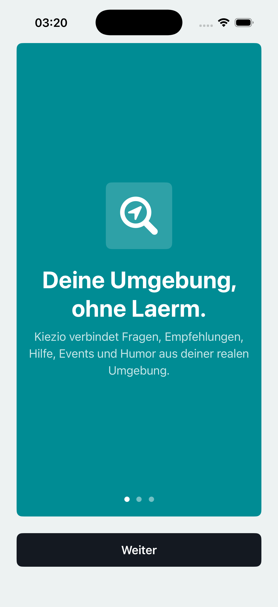

# Kiezio

**Deine Umgebung, ohne Lärm.**

Kiezio is an early iOS prototype for local, anonymous-ish community conversations: questions, recommendations, help, events, humour, and neighbourhood signal without turning the feed into a shouting match.

The product direction is intentionally **moderation-first**: protect open debate and controversial opinions, but draw clear lines against doxxing, threats, spam, targeted harassment, illegal content, and non-consensual intimate content.

<p align="center">
  
  &nbsp;&nbsp;
  
</p>

## What Kiezio is trying to do better

Kiezio is inspired by local community apps, but it is designed around a different social contract:

- **Local relevance over viral noise** — neighbourhood context, local help, events, recommendations, and lightweight humour.
- **Approximate location by design** — no public exact distance, no precise coordinate exposure in normal post flows.
- **Freedom of opinion with accountable limits** — viewpoint-neutral rules, transparent report reasons, proportional interventions, and appeal paths.
- **User control** — hide, mute, block, report, export data, and request account deletion.
- **Safety before scale** — moderation UX, auditability, and abuse controls are treated as core product surfaces, not later add-ons.

## Current prototype features

### iOS app

- SwiftUI iOS app project: `Kiezio.xcodeproj`
- Onboarding flow with privacy and local-signal positioning
- Local feed with mock spaces and posts
- Composer flow with safety friction before risky posts
- Post details, replies, reactions, and reporting entry points
- Safety Center for account/data controls and support links
- Video chat prototype surface with explicit safety controls
- Privacy manifest: `Kiezio/PrivacyInfo.xcprivacy`

### Backend prototype

- Minimal Python backend in `backend/kiezio_backend.py`
- SQLite persistence for prototype data
- Health, posts, replies, reactions, reports, controls, export, and deletion flows
- Backend tests in `backend/test_backend.py`

### Product and moderation docs

Key product notes live in `ops/kiezio/`, including:

- `ops/kiezio/product/safety-moderation.md`
- `ops/kiezio/product/privacy-location.md`
- `ops/kiezio/engineering/architecture.md`
- `ops/kiezio/engineering/data-model.md`
- `ops/kiezio/release/store-readiness.md`

## Moderation philosophy

Kiezio should make interventions understandable and contestable.

The intended moderation system is:

- **Viewpoint-neutral** — disagreement and unpopular opinions are not policy violations by themselves.
- **Context-sensitive** — local jokes, criticism, and heated debate are evaluated differently from targeted abuse or threats.
- **Proportional** — prefer reach reduction, prompts, user controls, or temporary limits before permanent removals when appropriate.
- **Transparent** — users should see the category and reason for enforcement.
- **Appealable** — moderation decisions need a route for review and correction.
- **Auditable** — backend state should preserve enough history to debug decisions and improve policy.

## Running locally

### Requirements

- macOS with Xcode 26.5 or newer
- Python 3 for the local backend

### Build the iOS app

```bash
xcodebuild \
  -project Kiezio.xcodeproj \
  -scheme Kiezio \
  -configuration Debug \
  -destination 'generic/platform=iOS Simulator' \
  build CODE_SIGNING_ALLOWED=NO
```

Or open in Xcode:

```bash
open Kiezio.xcodeproj
```

### Run backend tests

```bash
python3 backend/test_backend.py
```

### Start the local backend

```bash
python3 backend/kiezio_backend.py \
  --host 127.0.0.1 \
  --port 8787 \
  --db backend/kiezio.sqlite3
```

For testing from a physical iPhone, bind to all interfaces and use your Mac's LAN IP in the app environment:

```bash
python3 backend/kiezio_backend.py \
  --host 0.0.0.0 \
  --port 8787 \
  --db backend/kiezio.sqlite3
```

Example Xcode environment variable:

```text
KIEZIO_API_BASE_URL=http://192.168.x.y:8787
```

## Verification status

The current baseline has been checked with:

```bash
python3 backend/test_backend.py
xcodebuild -project Kiezio.xcodeproj -scheme Kiezio -configuration Debug -destination 'generic/platform=iOS Simulator' build CODE_SIGNING_ALLOWED=NO
```

Both passed locally before this README was published.

## Status

This repository is an active prototype. Expect rapid iteration on moderation, safety UX, privacy boundaries, and local-community mechanics.

## Repository

GitHub: https://github.com/Dachkovski/Kiezio
